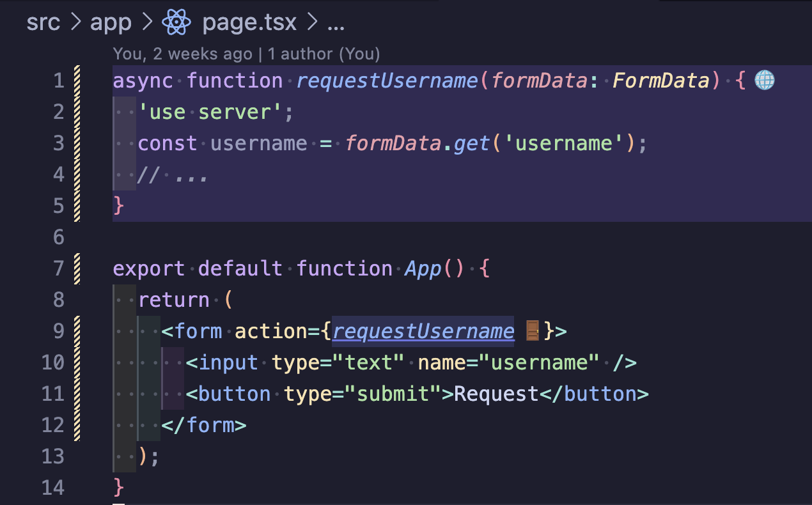

# Next.js Server Actions Highlighter

> A VS Code extension that visualizes the “definitions” and “call sites” of Server Actions (`'use server'`) to help you understand them quickly in the editor.



## Motivation
Server Actions are transformed into framework‑managed endpoints (POST), which makes the network boundary implicit and hard to see in code. By visualizing these definitions and call sites directly in the editor, this extension aims to improve readability and reduce review friction.

## Features
- Highlight definitions (blue‑purple line background)
  - Highlights the entire line range of the server action function body
  - Shows 🌐 inline at the end of the line that starts the block “{”
- Highlight call sites (expression range)
  - Blue‑purple background + solid underline on the same range + 🚪 inline at the end
  - Patterns: direct calls (`id(...)`/`obj.id(...)`), `<form action={...}>`/`formAction`, `startTransition(() => id(...))`, `useActionState(id, ...)`
- Auto filtering to reduce false positives
  - Only identifiers that are callables from imports or declared in the same file are considered
  - Uses the TypeScript Language Service to resolve definitions and decorates only when they match a Server Action

## Usage
1. Install this extension and open a Next.js (React Server Components) project
2. Open any `.ts/.tsx` file and visualization activates automatically (JS/JSX are not supported)
3. Server Action definitions are highlighted with a blue‑purple line background; call sites are highlighted by expression range

Tips
- Definitions target functions that satisfy both `'use server'` and `async`
- Also supports builder patterns (e.g., `createServerAction(async () => {...})`) and JSX inline `action={async () => {'use server'}}`

## Settings
You can tweak the background intensity and theme colors.

```jsonc
// Example (settings.json)
{
  "nextjs-server-actions-highlighter.highlight.definition.tintLight": "rgba(138, 99, 255, 0.14)",
  "nextjs-server-actions-highlighter.highlight.definition.tintDark": "rgba(138, 99, 255, 0.18)",
  "nextjs-server-actions-highlighter.highlight.definition.tintHighContrast": "rgba(138, 99, 255, 0.22)",
  "nextjs-server-actions-highlighter.highlight.call.tintLight": "rgba(118, 129, 255, 0.14)",
  "nextjs-server-actions-highlighter.highlight.call.tintDark": "rgba(118, 129, 255, 0.18)",
  "nextjs-server-actions-highlighter.highlight.call.tintHighContrast": "rgba(118, 129, 255, 0.22)",
  "nextjs-server-actions-highlighter.highlight.call.underlineColorLight": "rgba(118, 129, 255, 0.85)",
  "nextjs-server-actions-highlighter.highlight.call.underlineColorDark": "rgba(118, 129, 255, 0.85)",
  "nextjs-server-actions-highlighter.highlight.call.underlineColorHighContrast": "rgba(118, 129, 255, 0.9)"
}
```

## Supported Detections
- Definitions (`'use server'` + async)
  - `export async function foo() {}` / `export default async function ...`
  - `export const x = async () => {}` / `async function() {}`
  - Async function literals inside initializers of builder patterns
  - JSX inline: `action={async () => {'use server'}}`
- Call sites
  - Direct: `id(...)`, `obj.id(...)`
  - JSX: `<form action={...}>`, `formAction={...}`
  - `startTransition(() => id(...))`
  - `useActionState(id, ...)`

## Known Limitations
- Namespace imports: single-level calls like `ns.action()` are supported; multi-level chains like `ns.group.action()` are not.
  - Element access (`obj['action']()`) is not supported.
- Does not track indirect calls (via props/HOF) or `bind/apply`
- Async functions that don’t satisfy `'use server'` are not treated as definitions

## Troubleshooting
- Expected locations aren’t highlighted
  - Ensure the function meets `'use server'` + `async`
  - Ensure it’s declared as an imported or same‑file function
  - Use “Go to Definition” (F12) to check if it resolves to the intended Server Action
- If decorations conflict with other extensions, adjust background/underline intensity in settings

## How It Works (High level)
- Extracts definition and call candidates via AST (TypeScript Compiler API)
- Pre‑filters imports/local declarations to exclude global APIs (e.g., `alert`/`console`)
- Uses VS Code’s TypeScript Language Service to resolve definitions and decorate only when they match a Server Action (identifier/body range)

## License / Contributions
- Issues/PRs welcome. Proposals for UI/colors and unsupported patterns (e.g., namespace import/element access) are appreciated.

## Related
- Next.js Component Boundary Visualizer: https://github.com/makotot/vscode-nextjs-component-boundary-visualizer — A VS Code extension that visualizes component execution environments (client/server) via the 'use client' directive.
