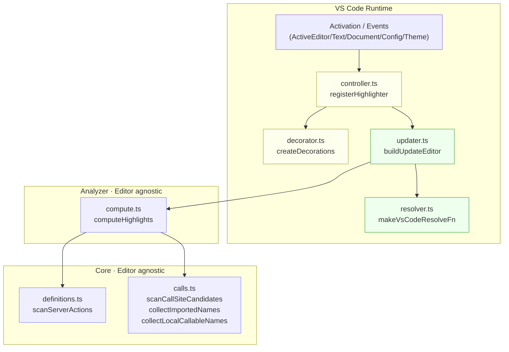

# nextjs-server-actions-highlighter — Architecture

This document summarizes the overall design, data flow, and responsibilities of the main modules. It reflects the MVP spec and notes potential extension points.

## Goals
- Visualize Next.js/React Server Actions by their “definitions” and “call sites” to accelerate review/debugging.
- Combine static analysis (TypeScript AST) with VS Code’s TypeScript Language Service (TS LS) to work without a build.

## User Experience (UX)
- Definitions: highlight entire lines of the server action function body with a blue‑purple background; show 🌐 inline at the end of the line where the block “{” starts.
- Calls: highlight only the expression range in blue‑purple and add a solid underline; show 🚪 inline at the right end.
- `<form action={...}>`/`formAction={...}` are always highlighted as entry points; other calls are highlighted only if resolution matches a Server Action.

## Architecture (Modules)
- core (editor‑agnostic)
  - `src/core/definitions.ts`: extract Server Action definition candidates (AST)
  - `src/core/calls.ts`: extract call‑site candidates (AST) + collect imported/local callable names
- analyzer (editor‑agnostic)
  - `src/analyzer/compute.ts`: apply policy (pre‑filter) and resolution (resolveFn) to extraction results and compute decoration offset ranges (pure function)
- extension (VS Code‑dependent)
  - `src/extension/controller.ts` (controller): event wiring and decoration lifecycle
  - `src/extension/decorator.ts` (decorator): create/destroy decorations (background, underline, inline emoji)
  - `src/extension/updater.ts` (updater): convert computeHighlights output to VS Code Ranges and apply
  - `src/extension/resolver.ts` (resolver): ResolveFn that calls VS Code’s TS LS directly
  - `src/extension.ts`: entry; invokes `registerHighlighter()`

## Data Flow (Mermaid)

## Languages
- Supported: TypeScript (`.ts`, `.tsx`)
- Not supported: JavaScript/JSX (`.js`, `.jsx`)

## Processing Details
### Definition Extraction (definitions.ts)
- Criteria (async is required for all):
  - Module begins with `'use server'`, or
  - Function body begins with `'use server'`
- Targets:
  - `export async function` / `export default async function`
  - `export const x = async () => {}` / `async function() {}`
  - Async function literals inside initializers (builder/factory)
  - JSX inline `action={async () => { 'use server' }}`
- Output: `ServerActionSpan { name, bodyStart/end, nameStart/end }`

### Call Candidate Extraction (calls.ts)
- Syntax covered:
  - JSX: `<form action={...}>`, `formAction={...}`
  - Direct calls: `id(...)`, `obj.id(...)` (unwraps `((id))()`, `id!()`, `id as any()` etc.)
  - Calls inside `startTransition(() => id(...))`
  - First argument identifier of `useActionState(id, ...)`
- Ranges:
  - Direct calls and those inside `startTransition`: from identifier start to the end of the call (including parentheses)
  - JSX `action`/`formAction`: the expression range itself
- Deduplication: suppress with a Set keyed by `kind:start:end`

### False Positive Reduction (pre‑filter in updater.ts)
- Use `collectImportedNames()` for import‑introduced local names and `collectLocalCallableNames()` for callable local names in the same file.
- Skip when `calleeName` matches neither set (filters out globals like `alert()`).

### Resolution and Final Server Action Decision (resolver.ts / highlight)
- resolver.ts: ResolveFn that directly calls VS Code’s TS LS (`makeVsCodeResolveFn`).
- analyzer/compute.ts: receives ResolveFn via DI, correlates extraction results, and determines final highlight ranges.
  - A match occurs when the resolved definition position lies within the action’s identifier or body range (= a Server Action call).

### Decorations (decorator.ts)
- Definitions: whole‑line background (blue‑purple) + 🌐 at the start‑brace line end.
- Calls: expression background (blue‑purple) + solid underline on the same range + 🚪 at the end.
- Theme colors are selected from settings (light/dark/high contrast).
- The underline color for call sites is also configurable per theme (light/dark/high contrast).
- Updater merges overlapping ranges.

## Settings (package.json)
- Definition background tint:
  - `nextjs-server-actions-highlighter.highlight.definition.tint{Light,Dark,HighContrast}`
- Call background tint:
  - `nextjs-server-actions-highlighter.highlight.call.tint{Light,Dark,HighContrast}`

## Why LSP (TS Language Service)?
- Extraction (AST scan) is possible without LSP, but precise mapping from call → definition requires LSP‑level semantic analysis.
- Cross‑file resolution and alias/re‑export handling:
  - Handles `import { a as b } from 'x'`, barrels, namespace import (`import * as ns` → `ns.fn()`), and path aliases (`baseUrl`/`paths`).
- Value/type separation and .d.ts handling:
  - Distinguish `import type`, type symbols, and jumps to `.d.ts`, restricting to executable Server Actions as values.
- Definition normalization and hops (chasing):
  - Combine Definition/TypeDefinition/Implementation to reach the concrete target within up to n hops (this extension uses 3).
- Project configuration and incremental analysis:
  - LSP maintains analysis state per tsconfig (project references/composite/JSX settings), avoiding rebuilds.
- False positive suppression and extra value:
  - Globals like `alert()` resolve to lib and are easy to exclude.
  - Aligns well with future features like Hover/Find References/CodeLens reference counts/rename safety.

## Performance
- Analyze only the active editor’s text.
- Minimize AST traversal.
- Reduce per‑candidate resolution via pre‑filters.
- Optional optimizations: debounce, lightweight cache per file version.

## Known Limitations (MVP trade‑offs)
- Namespace import: single‑level `ns.action()` is supported; multi‑level chains like `ns.group.action()` are not.
- Element access: `obj['id']()` is unsupported.
- Additional entrypoints like `queueMicrotask`, `setTimeout` callbacks are unsupported (could be made configurable).
- Destructuring inference is basic (limited extraction of `const { action } = mod`).
- Hop count is 3 (weak against deep re‑export chains).

## Tests
- Unit/integration (Vitest)
  - `src/analyzer/__tests__/compute.test.ts`: parameterized coverage of the upper flow (extract → filter → resolve → range generation)
    - Local definitions + calls, via imports, startTransition/useActionState, builder/factory, JSX inline, exclusion cases (alert/console, unsupported: element access/namespace import)
